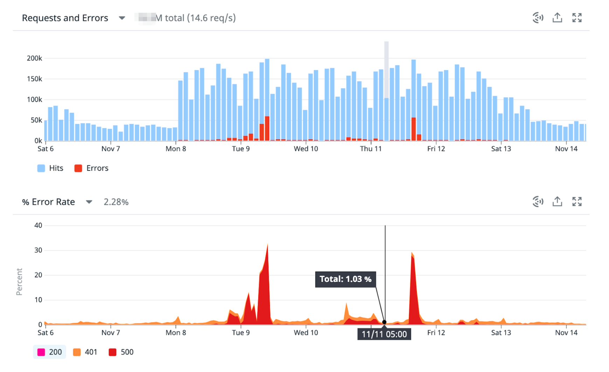
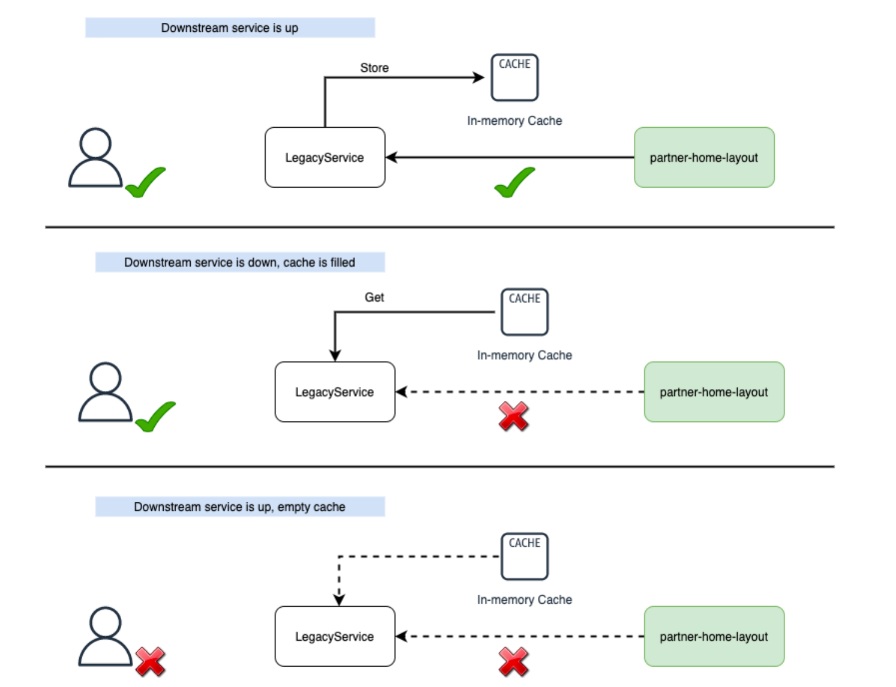

<figure class="figure figure--right">
  
</figure>

I like thinking about monitoring and [alerting](../monitoring-alerts-that-dont-suck/) a lot. [SLOs](../multiwindow-multi-burn-rate-alerts-in-datadog/) have been one of my latest obsessions over the past few months.

However, all these metrics are worthless if left unattended! Worse than worthless. If you have comprehensive alerts that don't get fixed, you'll get swamped by a barrage of alerts.

That's precisely what I want to talk about. This post covers making services more tolerant against downstream failures, using the wonderful [resilience4j](https://resilience4j.readme.io/).

## Instability Can Ruin Your Day

In my last project, I maintained a service with high visibility. The service didn't own any data, relying instead on several downstream dependencies. Sadly, these dependencies were very unstable and experienced frequent downtime. The issues propagated to our service, causing errors. It made us look bad. Check these error spikes:

<figure class="figure">
  
  <figcaption class="figure__caption">
  Shit is hitting the fan
  </figcaption>
</figure>

Not only were our users getting a mediocre experience, but our [On-Call](https://github.com/sirech/talks/blob/master/2021-11-devoxx-humane_on_call_alerting_doesnt_have_to_be_painful.pdf) rotations were becoming a shitshow. We _had_ to do something about it. It was leading to a dangerous spiral that could only end in burn-out.

## Enter Resilience4j

Our service is written in Java. That makes `resilience4j` a natural fit. In case you don't know, it's a library written by Netflix focused on fault tolerance. As a bonus, it's based on [Vavr](https://www.vavr.io/). Thus, it benefits from things like the [Either type](../kotlin-either-types-instead-of-exceptions/) and all that good stuff. It's right up my alley.

To prevent the nasty error spikes I showed above, we're focusing on two things:

- Using resilience operators to make our microservice a better-behaved citizen
- Building a fallback cache to prevent downstream errors from affecting our users

## Using Resilience Operators

`resilience4j` provides a bunch of [operators](https://resilience4j.readme.io/docs) out of the box that increases the fault tolerance of your remote calls. One big plus of this library is its composability. There's little difference between using a [Retry](https://resilience4j.readme.io/docs/retry) alone or piping other operators like a [CircuitBreaker](https://resilience4j.readme.io/docs/circuitbreaker). I'm not getting into the details of how they work, head over the documentation to get more details.

If you use [Spring Boot](https://spring.io/projects/spring-boot), there's support for using annotations. There's always support for annotations if SpringBoot is involved. Interestingly enough, I feel the annotations create a bit too much duplication. See, I wanted to apply a common set of operators to six or seven remote calls. Annotating the methods and adding the fallbacks led to a messy solution.

Instead, I built a small abstraction, a _FallbackCache_. Before we consider the caching part, let's focus on instantiating these operators. The code is quite declarative:

```java
Retry getRetry(String name, MeterRegistry meterRegistry) {
  RetryRegistry retryRegistry = RetryRegistry.ofDefaults();
  TaggedRetryMetrics.ofRetryRegistry(retryRegistry).bindTo(meterRegistry);
  return retryRegistry.retry(name);
}

CircuitBreaker getCircuitBreaker(String name, MeterRegistry meterRegistry) {
  CircuitBreakerRegistry circuitBreakerRegistry = CircuitBreakerRegistry
      .ofDefaults();
  TaggedCircuitBreakerMetrics
      .ofCircuitBreakerRegistry(circuitBreakerRegistry).bindTo(meterRegistry);
  return circuitBreakerRegistry.circuitBreaker(name);
}
```

There are a vast amount of settings that you can configure. The default settings work well to get started. On top of that, I'm adding metrics for [micrometer](https://micrometer.io/).

## Building a Fallback Cache

Building resilience operators is only one part of the equation. Yes, we're retrying failed requests automatically. Thanks to the circuit breaker we won't [DDOS](https://en.wikipedia.org/wiki/Denial-of-service_attack) downstream services. But the user won't care. As it is, the errors propagate back to them.

My answer is a fallback cache. The flow is as follows:

<figure class="figure">
  
  <figcaption class="figure__caption">
  That's a happy user
  </figcaption>
</figure>

This boils down to three steps:

- Make a call to the downstream service with retries and a circuit breaker
- If the call works, store the result in a cache and return it
- If the call fails, use the cache to serve a fallback so that the user experience isn't compromised

Before you ask, caching proactively wasn't an option as we didn't have a way to invalidate the cache when the underlying data changed. Anyhow, these three steps map nicely to a class with the following methods:

```java
public class SyncFallbackCache<T, R extends Cacheable<T>> extends AbstractFallbackCache<T, R> {
  public T get(Supplier<String> keySupplier, Supplier<R> valueSupplier);
  private T getAndCache(String key, Supplier<R> valueSupplier);
  private T getFromCacheOrThrow(String key, RuntimeException exception);
}
```

Let's go one by one.

### Making the Call

The fallback cache doesn't do anything on its own, as it's rather a wrapper. We use a [Supplier](https://docs.oracle.com/javase/8/docs/api/java/util/function/Supplier.html) to pass the operation to perform. We need a key to identify the element in the cache, which uses another supplier for extra flexibility.

```java
public T get(Supplier<String> keySupplier, Supplier<R> valueSupplier) {
  Supplier<T> decoratedSupplier = Decorators.ofSupplier(() -> getAndCache(key, valueSupplier))
      .withRetry(retry)
      .withCircuitBreaker(cb).decorate();

  var key = keySupplier.get();

  return Try.ofSupplier(decoratedSupplier)
      .recover(RuntimeException.class, (exception) -> getFromCacheOrThrow(key, exception))
      .get();
}
```

We decorate the supplier with our operators. If the call works, we return the result. If not, there's a [Try](https://www.javadoc.io/doc/io.vavr/vavr/0.9.2/io/vavr/control/Try.html) wrapping it that looks for something to serve from the cache. An empty cache means we're out of options, and we can only propagate the error upstream.

### Store the Result

Whenever we get a valid result, we store it in the cache. Let's assume that `valueSupplier.get()` returns without any errors:

```java
private T getAndCache(String key, Supplier<R> valueSupplier) {
  /*
    This has the disadvantage that the [get result, cache it] is not atomic. So if two requests try to update the same key at the same time, it might create an undetermined result.

    However, two calls to the same service should return the same value, so we should be able to live with that.

    This is not happening inside the compute method anymore due to problems acquiring the lock that led to significant timeouts.
   */
  var result = valueSupplier.get();
  if (result == null) {
    return null;
  }

  return Try.of(() -> {
    cache.save(result);
    return result;
  })
      .recover(Exception.class, e -> {
        log.error("Could not save result to cache", e);
        return result;
      })
      .map(Cacheable::data)
      .get();
}
```

This action should be as seamless as possible. We want to avoid blocking anything while we save the data. Moreover, we swallow any error that happens while saving. Failing to save to the cache shouldn't result in a failed request.

### Use the Fallback

If the supplier didn't work, our last hope is to find some content in the cache for the associated key. We can show valid, albeit possibly outdated, information to the user. A cache miss ends up with the original exception.

```java
private T getFromCacheOrThrow(String key, RuntimeException exception) {
  var value = cache.findById(key);

  value.ifPresent((v) -> {
    log.info(String.format("FallbackCache[%s] got cached value", cb.getName()), v);
  });

  return value
      .map(Cacheable::data)
      .orElseThrow(() -> {
            log.error(
                String.format("FallbackCache[%s] got an error without a cached value", cb.getName()),
                exception
            );
            throw exception;
          }
      );
}
```

### The Caller's Perspective

As a user, I need to instantiate a `SyncFallbackCache` and call the public method with the operation I want to safeguard.

```java
private SyncFallbackCache<Collection<SupplierUserPermission>> permissions;

private Collection<SupplierUserPermission> getPermissions(
    int userId, 
    int supplierId) {
  return permissions.get(
      () -> String.format("id:%s;suId:%s", userId, supplierId),
      () -> client.getUserPermissions(userId, supplierId)
          .getData()
          .getSupplierUserMyInformation()
          .getPermissions()
  );
}
```

As you can see, we don't need to know about what's happening underneath. It's pretty nifty. You could argue that the return type isn't explicit enough, as the method may throw an exception that's not part of the signature. An alternative is to model it with an [Either](https://www.javadoc.io/doc/io.vavr/vavr/0.10.0/io/vavr/control/Either.html).

## Where's the Cache?

I haven't spoken about the cache. The easiest alternative is using an in-memory cache like [Caffeine](https://github.com/ben-manes/caffeine). Something like this:

```java
static <R> Cache<String, R> cache(String name, MeterRegistry meterRegistry) {
  Cache<String, R> cache = Caffeine.newBuilder()
      .recordStats()
      .expireAfterWrite(Duration.ofHours(24))
      .maximumSize(6000)
      .build();

  CaffeineCacheMetrics.monitor(meterRegistry, cache, name);
  return cache;
}
```

This approach is convenient yet flawed. Our application runs as a container. Every time it's restarted, the cache is wiped out. It leads to a bad hit rate percentage, which hovered around 65-70%. That's not great for a cache and still propagates way too many failures to the end-user.

We switched to a persistent cache based on [Aerospike](https://aerospike.com/) to mitigate the problem. _SpringBoot_ has some integrations to make this easier:

```java
public interface NavigationRepository extends
    AerospikeRepository<CachedNavigation, String> {
}
```

```java
@Value
@Document(collection = "navigation_CachedNavigationMenu")
public class CachedNavigation implements Cacheable<List<LegacyNavMenuItem>> {
  @Id
  String id;
  List<LegacyNavMenuItem> navigation;

  @Override
  public List<LegacyNavMenuItem> data() {
    return navigation;
  }
}
```

Using the cache for failure scenarios means invalidation isn't that relevant. The persistent cache made a tangible difference that brought our hit rate percentage to the high 90s. That's a lot better, isn't it?

## A Journey With a Happy Ending

Was all this effort _worth it_? Hell, yes. Our error rate went from 2% to 0.03%. We've set an SLO for the service's availability of 99,95%. Our rotations became significantly smoother. I had so much time available that I could write blog posts about it!
