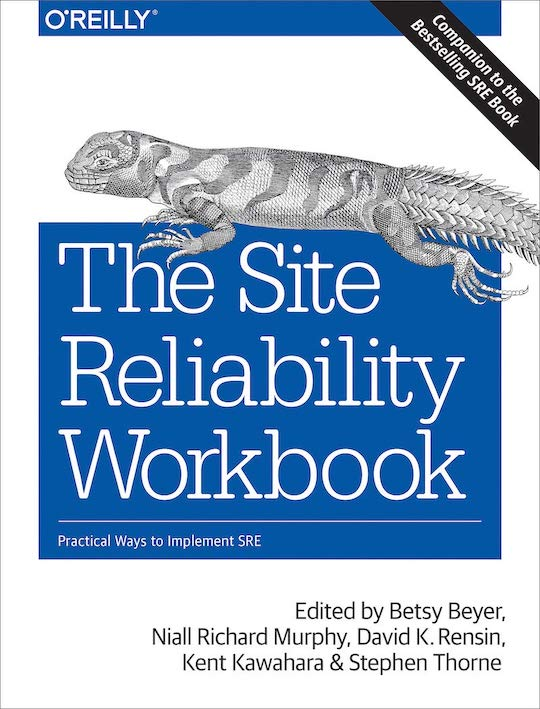

<figure class="figure">
  
</figure>

[Site Reliability Workbook](https://sre.google/workbook/table-of-contents/) is the successor of [Site Reliability Engineering](https://sre.google/sre-book/table-of-contents/). In the first book, Google introduced its vision of site reliability to the world, launching countless discussions about the distinction between SRE and DevOps.

One common criticism of that treaty was that it was hard to apply for organizations with fewer resources than Google. The second book aims to fix that. This time around, they're focusing on discussing practices that anybody can implement to become more effective at operating live systems.

## So Much Content

This book is a gigantic `HOWTO` on how to implement SRE. There's a good amount of theory, there's is source code, and there are case studies. It covers three areas throughout its almost 500 pages:

### Foundations

Foundations are the base building blocks you'll use daily if you adopt an SRE approach. SLOs, monitoring, toil, and a call for simplicity in software architecture.

### Practices

What kind of practices help to continuously improve and iterate? Having a healthy On-Call rotation for one. Handling incidents in general features prominently, including reflecting on causes and next steps in postmortems.

Interestingly, how to handle configuration is another big topic here. I was pleasantly surprised to learn that Google emphasizes manageable configuration definitions. They mention [jsonnet](../templating-concourse-pipelines-with-jsonnet/) as a tool to handle that complexity.

### Processes

The last part of the book is about processes. How should an SRE team engage with other teams? How do they recognize if the time for collaboration is over? In a way, this section reminds me of another book, [team topologies](../book-review-team-topologies/). I've lost count of how many times I've said that a platform team and an enablement team have completely different mandates. This part really resonated with me.

## Let's Talk About SLOs

Chapter 5 focuses on [service level objectives (SLOs)](https://sre.google/sre-book/service-level-objectives/). It's by far my favorite chapter. I've re-read it over and over. I've spent a lot of time thinking about alerts over the past year. 

Understanding how to implement [multiwindow, multi-burn-rate alerts](../multiwindow-multi-burn-rate-alerts-in-datadog/) improved my quality of life massively when I was on a project that suffered from poor alerts. And let me tell you, it's not an easy thing to understand. Don't underestimate the complexity behind implementing high-quality alerts.

This book is the best source to understand SLOs. It's worth getting just for this chapter alone.

## Verdict

This book covers a lot of ground. There's a lot to unpack, much of it extremely actionable. I've found myself coming back to it a lot lately. It seems to have more sticking power than the first book. I think it's a very recommendable read. It gets ⭐⭐⭐⭐ stars from me.
