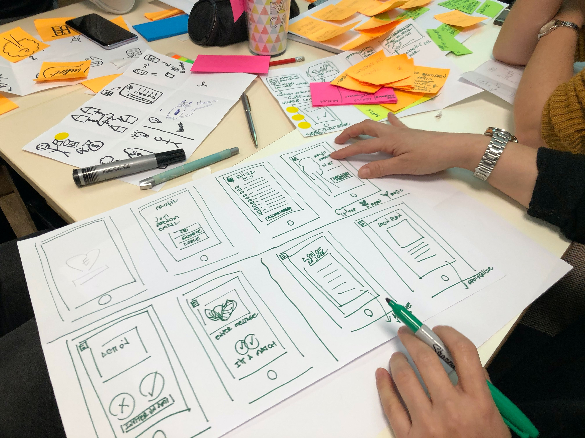

<figure class="figure figure--right">
  
</figure>

System design [interviews](https://blog.pragmaticengineer.com/preparing-for-the-systems-design-and-coding-interviews/) are a staple of interviewing loops at BigTech. In a system design interview, your job is to design a complex system, such as a video platform like YouTube. You aren't required to code anything. Instead, you focus on the high-level architecture and discuss aspects like scalability for your design.

Usually, only somewhat senior candidates get this interview. The assumption is that you need to gather a certain amount of experience before you can talk about designing systems in depth. However, it wouldn't be out of the ordinary if you haven't done one of these before. It all depends on your career path. In this article, I want to share what I've learned while preparing for them.

## What Am I Supposed to Show in a System Design Interview?

In this interview, you show your technological breadth and depth. You consider the different trade-offs and work with the interviewer to get the best solution you can in the allotted time.

It's not just about technology, though. The problem is almost always unclear and loosely defined. It's up to you to bring clarity, understand what to build in more detail, and discuss the alternatives.

Keep in mind that system design can be decisive in your leveling, even more so than the coding part. Check this [video](https://www.youtube.com/watch?v=ZgdS0EUmn70) from Jackson Gabbard is an excellent introduction to the topic.

## A Solid Foundation

The first layer of preparation is your day-to-day job. If you're designing systems, you have the opportunity to hone your skills and acquire experience.

So, practice as much as you can! Write your proposals as [RFCs](https://blog.pragmaticengineer.com/scaling-engineering-teams-via-writing-things-down-rfcs/) and get feedback from senior engineers in your organization. Review other people's designs. If this isn't a well-established process, maybe there's an opportunity to drive that initiative. It'll do wonders to your engineering palate. Even if you don't operate at BigTech scale, it's a valuable experience.

If your company doesn't provide any opportunity to engage in these activities, you should consider moving to a different place. Technical decisions made without any debate? That sounds suspect to me.

## Preparation Materials

<figure class="figure figure--left">
  
  <figcaption class="figure__caption">
  The bible of System Design
  </figcaption>
</figure>

Designing data-intensive applications ([DDIA](https://hceris.com/book-review-designing-data-intensive-applications/)) is the canonical book for system design. It's almost a mandatory read as it covers such a vast amount of topics that are relevant to system design. Additionally, it helps polish your vocabulary to communicate more efficiently with the interviewer.

Specialized courses are popping up that cover the topic. Alex Wu's [course](https://courses.systeminterview.com/) is probably the best and completely worth your money.

YouTube has a ton of content. For instance, this [channel](https://www.youtube.com/channel/UCRPMAqdtSgd0Ipeef7iFsKw) is a good source of inspiration. [QCon's](https://www.youtube.com/nctv) talks are good as well.

Lastly, BigTech companies almost always maintain an engineering blog. That's an excellent resource to understand how they fix their problems.

## Practicing Actual Interviews

Once you have a solid base, it's time to practice. Unlike coding interviews, system design is hard to practice alone. System design interviews are very reliant on timing. You're looking for an intuitive feeling of how long to spend on each part of the interview. I don't think you can get the timings right without testing them under realistic conditions.

Mock interviews are by far the most effective way to practice system design. You can use [interviewing.io](https://interviewing.io/) if you're in a rush and don't mind paying. Or check one of the many interviewing-oriented Discord channels and find a buddy to run some mocks.

It took me a lot of mental effort to start doing mock interviews. I just found it awkward. I tried to get by doing it by myself. I can tell you it's not the same. Get over it as fast as possible. It's worth it.

Don't go into a system design interview without practice. You're almost guaranteed to fail.

## Tips And Tricks

There's a vast amount of materials out there. I won't cover the basics, or tell you to do [capacity planning](https://www.dballona.com/en/system-design-capacity-planning-basics) or anything like that. Instead, I'm focusing on some realizations that helped me polish my interviews.

- _Manage Time_. Interviews are shorter than you think. To pass a senior loop, you have to make sure that you handle time effectively
- _Reduce Scope_. This is related to time management. System design problems are almost always bigger than what you can handle in an hour. You have to find ways to reduce the scope. Otherwise, you might leave the problem unfinished, or fail to dive into a concrete area. 
  - Your main scoping tool is the functional requirements. Don't define too many of them
  - Be prepared to descope during the high-level design. If you realize that you're trying to do too much, offer to skip some parts or skip details. Whatever you do, don't risk a half-finished solution
- _Don't repeat yourself_. Train to not repeat the same thing multiple times. You need all the extra time you can buy
- _Have an agenda_. I'll get to this in a second
- _It's not a quiz_. Some people memorize extremely specific details. That misses the point. I would say that presenting a coherent and reasoned solution is better, even if you skip some details
- _Talk about trade-offs_. Every design has pros and cons. You should ensure that you explain the consequences of your decisions and how they inform your design
- _Who uses the System?_ It's tempting to dive into replication strategies, partitioning, and a multitude of other technical challenges. But you should always keep the user in your mind. Who is using the system? What's their success? If I introduce a change in my design, will it result in a better experience for them?

A lot of these suggestions are very fuzzy. How much scope is too much? How do you know how much time you can spend in an area? That's why you practice. You need to get a feeling of that, and that's only happening if you practice in advance. 

## Present a Clear Structure

<figure class="figure figure--right">
  
  <figcaption class="figure__caption">
  We're getting somewhere here
  </figcaption>
</figure>

There's so much you can talk about in a system design interview. It's easy to get lost or start aimlessly rambling. That's why it's useful to create a rough outline of the topics you're going to cover. It has two crucial benefits:

- You have a structure to follow to keep you on track
- You align with the interviewer. If they want to dive into a topic, make sure to integrate that into your plan and cover it

Note that you should **never** repeat the same structure for each interview. You've got to figure out the relevant parts for the problem at hand and consider your interviewer's expectations. They surely want to touch on some topics. Don't ignore those.

With that being said, this is a sample agenda I've used before:

1. Problem Exploration
   1. Functional Requirements
   2. Cross-Functional Requirements
   3. What is the success case for the user, and how to measure it
2. Plan
   1. Propose a list of topics
   2. Align on items to cover
3. Quantitative Analysis
   1. QPS
   2. Data amounts
4. API
5. High-Level Design
   1. Main services
   2. Interactions between them
   3. What kind of data do you produce and store
6. Deep Dive
   1. Find the most promising topic to dive in
   2. Go as deep as you can
   3. Trade-offs!
7. Operational concerns
   1. Points of failure (error handling**
   2. Monitoring
   3. Analytics -> Business metrics
8. Scaling Up
   1. What are the bottlenecks
   2. Elasticity

Remember that you won't have time to talk about everything.

Another way to use an agenda to your benefit is to come back to it as you address different topics. If your design is close to complete, go back to the requirements and check that you covered them.

**Huge Disclaimer**: If you sketch a plan, it's fundamental to make sure you hold yourself to it. If you only manage to run through half of it, you're pretty much priming your interviewer to fail you. Practice until you can manage the timeslot. Be prepared to descope things as you move along, but don't ever get to the point where the interviewer cuts in the middle of a sentence with something like "We don't have any more time, let's stop here".

## Logistics

Use a diagramming tool. Get familiar with one so that you don't waste time trying to draw circles. I like [Whimsical](https://whimsical.com/) or [Excalidraw](https://excalidraw.com/).

Write down things! Don't leave empty boxes. If you're talking about a topic, write it down, even if only on a high level. The interviewer might go back to the board after the interview. It's always a challenging balance to strike, as writing absolutely everything you say will slow you down significantly.

## Putting it All Together

As you can see, the system design interview focuses on you showing how to apply your experience in technology to fix a nebulous problem in the best way possible. It's fuzzy and open-ended, and it requires you to think clearly and communicate efficiently. Improve your chances of success by working on all these pieces in advance!
