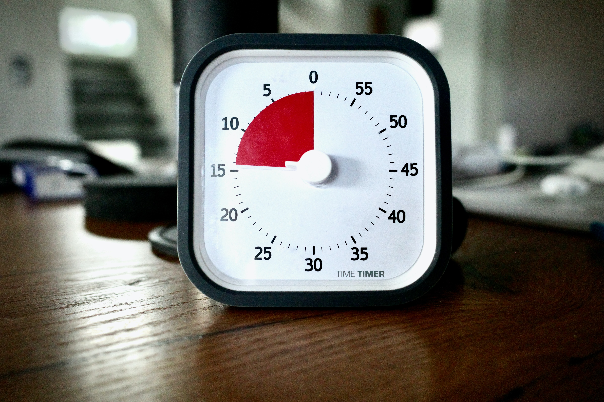

<figure class="figure figure--right">
  
</figure>

Retrospectives are an integral part of [Agile](https://www.atlassian.com/agile). When they are effective, they provide a powerful tool for continuous improvement. However, when they go wrong they become a catalyst for frustration and pointless venting. You don't want to end your week on such a negative note, do you?

While I won't claim to be an expert facilitator, I've experienced my fair share of crappy retros to know what I like and don't like. Let's talk about how to run retros productively. You don't need a dedicated agile coach to get meaningful outcomes.

## What Is a Retro?

Short and sweet: It's a regular meeting where the team comes together and reflects on all that has happened lately. You discuss the most promising topics and seek actions to improve.

How do you recognize a good retro? Well, what about the opposite question? What are some retro smells that can doom the whole endeavor?

## Retro Smells

<figure class="figure figure--left">
  
  <figcaption class="figure__caption">
  Healthy debate
  </figcaption>
</figure>

The one thing that grinds my gears is poor time management. For example, collecting stickies for 55 minutes and then realizing that you have only five minutes to half-ass some action items.

Another questionable habit is talking about things that you can't influence. Don't get me wrong: sometimes it's good to vent and blow off steam. But it can't become the norm. Otherwise, you'll create a fountain of negativity.

My last personal favorite is the topic that comes up repeatedly, without ever getting to any resolution. Extra points if it's an overly generic thing like *not enough communication*.

Everybody has their pet peeves. As a facilitator, it's your job to sidestep them and foster a productive ritual.

## Following A Structure

I tend to follow a familiar structure. I want *repeatability* and *predictability*.
That's easier to do with a general framework. At the same time, you want to adapt to what people want to talk about. This is my rough script for a 60 minutes slot.

- Set the Tone
- Icebreaker
- Previous Actions
- Reflection
- Actions
- Wrap-Up

Let's go a bit more into detail.

### Set the Tone

Start with a quick (I repeat, quick) reminder that a retrospective is a safe space. Have you read the [Prime directive](http://retrospectivewiki.org/index.php?title=The_Prime_Directive)? It does sound a bit tacky, to be fair. Behind the "Star Trek"-like message hides an important question: Are people comfortable talking about potentially uncomfortable topics? If not, you have serious problems that can't be fixed by gathering people in a room. Sorry for that.

### Icebreaker

Icebreakers are small activities to lighten the mood. It seems silly, but it doesn't hurt, provided you don't invest too much time. Focus on the positive.

The icebreaker that consistently works best for me is collecting kudos. Spend a few minutes letting people thank others for their work and contributions. Share it broadly.

### Previous Actions

It's crucial to keep track of the actions decided in previous retrospectives. Are you accumulating a long list of unclaimed actions that won't ever happen? That's a huge red flag.

I like to go over previous actions to check progress. For the incomplete ones, it's worth ensuring they're still relevant and necessary. Prune the obsolete ones, and carry the rest as part of this iteration. It's fine, but keep an eye on actions that never go anywhere.

### Reflection

Now comes the meaty part. You're going to do an exercise where you leave time for the participants to collect their thoughts and write them down in stickies. There are many formats for this. A typical one is to use three buckets like this:

- Start Doing
- Stop Doing
- Continue Doing

Areas that aren't going well hold the most potential for improvement. Nevertheless, don't tunnel too much on those. A reminder of activities worth keeping alive can be very useful, even if it doesn't merit further debate.

Be very, very careful of sticky overdose. Collecting 50 stickies is great until you realize you won't get to discuss 95% of them. Here is the spot where many retros go awry. Limit the number of stickies to keep the logistics manageable.

Once you collect all these wonderful ideas it's time to read them to ensure they're clear to everybody. Then, group them and let people vote for the ones they want to discuss. This is a clarification process, don't allow discussions to start just yet. Some people love to talk about their pet issues regardless of priority. They might monopolize the limited time if you aren't careful.

<figure class="figure figure--right">
  
  <figcaption class="figure__caption">
  The most important tool in any retro
  </figcaption>
</figure>

No matter how efficient you are, you'll have consumed about half the time by now. You'll have time for about three topics. I like to use a very rigid structure for this:

- Pick the most-voted topic
- Start a timer for 7 minutes. Use the slot to explore the problem and think of actions
- Once the timer is over, I move on to the next topic. If I feel that people still want to talk a bit more, I do a quick thumbs up / thumbs down vote to confirm the suspicion. You might discuss fewer topics, but you don't leave a conversation unfinished

You might read this and recoil in horror. It's so formulaic! However, there's a reason behind it. If you want to finish on time, you'll have to be ruthless with time management. If you explain the rules in advance, it feels less rude and awkward. Remember, we're committed to finishing on time.

### Actions

<figure class="figure figure--left">
  
  <figcaption class="figure__caption">
  Realistic actions
  </figcaption>
</figure>

A healthy discussion has value on its own, but we want to foster improvement. That requires some actions. As the facilitator, you have to be on the lookout for them. Pounce when given the opportunity.

There are plenty of catchy acronyms to define good action items, such as [SMART](https://en.wikipedia.org/wiki/SMART_criteria). Follow the one you like. Remember that any action needs to be doable in a reasonable time frame. Ideally before the next retro. I refuse to write down commitments unless I can assign a person to them. I think that actions without an owner are as good as useless.

What if you don't find any actions to take? It's not ideal, but it happens. I've seen facilitators push to get some action, any action will do. I disagree with this approach. If you couldn't find a meaningful thing to do, so be it.

### Wrap-Up

If you did everything well until now, you'll have about one minute left to wrap up, summarize the actions, and thank everybody for their time. Well done, recruit!

Write this summary down somewhere, especially the actions. Make sure that you aren't sharing things you shouldn't.

## Scaling it Up

So we got one decent retro. Good! Now let's make it a regular occurrence. There's no reason that you can't get a reproducible result.

I believe that team rituals shouldn't be owned by an individual. Spreading them across the team increases ownership. Thus, I think moderation should rotate among the people on the team. It's good practice for them and an antidote against having the same people talking all the time.

As a parting piece of advice, shake things up! Repeating the same format all the time puts people on auto-pilot. Switch formats occasionally to keep it fresh. Every now and then, do a completely different thing. A futurospective about where the team wants to be next year. Focus on only one topic that's important for the team.

## What Do We Actually Get Out of Retrospectives?

<figure class="figure figure--right">
  
  <figcaption class="figure__caption">
  Enlightment state
  </figcaption>
</figure>

Getting quality action items is good. Implementing them within a reasonable time frame is even better. Let's start with that.

That said, I think retrospectives are also about creating a culture of reflection. It's easy to let routine take over and do things the same way as before. Reflective teams are proactive in finding ways of improving on their own. A good retrospective is one small step towards that lofty goal.

