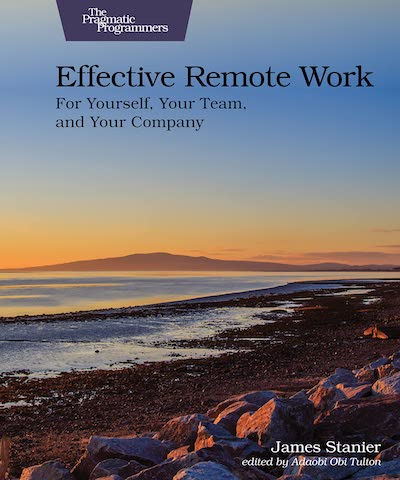

<figure class="figure">
  
</figure>

[Effective Remote Work](https://pragprog.com/titles/jsrw/effective-remote-work/) is a book about, well, remote work. The author, James Stanier, works for [Shopify](https://shopify.engineering/), a company with a long tradition of working remotely.

These past few years have been a large-scale experiment in working remotely for most tech companies. However, the way it happened was so abrupt and unprepared that many people had a miserable experience.

It's time to correct that! Despite the bumpy start, many companies still offer at least hybrid work. It seems this practice is here to stay. This book is a great resource about making remote work effective, productive, and sustainable. Let's go over some of the things it mentions.

## No Second-class Citizens

The book advocates treating everybody as a remote worker. I like that goal. You start with basic stuff like ensuring you don't forget to include remote people in meetings. But it goes beyond that. Are they included in decision-making? Do they have the same career opportunities as people going to the office daily?

## Proper Onboarding

A good onboarding plan is a must whether you work remotely or not. Working remotely magnifies a bad experience. Sitting at home feeling helpless because you don't know something is frustrating. Remote workers need to be able to unblock themselves, and you need to help them with that.

## Durable Artifacts

This point completely matches my experience in the past three years of working remotely almost full-time. Collaboration around **durable** artifacts should be at the center of everything you do. If you don't regularly create easily accessible documents, you'll repeat the same conversations over and over. Or, even worse, decisions will happen ad-hoc in secret meetings.

Good technical writing makes written communication better. Go check [Google's courses](https://developers.google.com/tech-writing/overview) for a great resource.

## The Spectrum of Synchronousness

People might not answer immediately when you have a question. You need to balance between things that require synchronous communication and the ones that can wait. If you have worked with people in different time zones you'll know what I mean. 

## The Remote Test

Similar to [the Joel Test](https://www.joelonsoftware.com/2000/08/09/the-joel-test-12-steps-to-better-code/), the book ends with a list of criteria for remote work. The questions that help determine if you're ready are:

1. Do you treat everyone as remote?
2. Do you provide a remote workspace setup?
3. Do you spend money equally on in-office and remote staff?
4. Do you optimize for asynchronous communication?
5. Do you create artifacts from synchronous interactions?
6. Do you measure staff by their impact?
7. Do you allow staff to choose flexible hours?
8. Are the members of the executive team remote workers?
9. Do you use the best collaborative tools that money can buy?
10. Do you hire staff anywhere in the world?
11. Do you support families as well as employees?
12. Do you give back to an employee's local community?

## Verdict

This book is very poignant now that remote work has normalized to a never-seen-before degree. Many companies have embraced the practice. Thus, it's worth investing in understanding how to be effective in this environment. Compared to another book like [Remote: Office Not Required](https://www.amazon.com/Remote-Office-Required-Jason-Fried/dp/0804137501), there's a lot of actionable advice that you can apply starting today. It gets ⭐⭐⭐⭐ stars from me.
