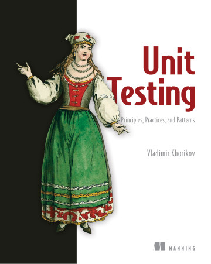

<figure class="figure">
  
</figure>

[Unit Testing](https://www.manning.com/books/unit-testing) is a book that, despite its title, isn't just about unit testing. While that's a significant portion of the book, there's more.

You get a lot of advice on how to write tests. How to make them effective and leverage those tests to improve code through refactorings. It touches on other topics, such as mocks or even integration tests. There's a lot of good stuff to mention in just a few lines.

Anyhow, two parts stood out the most to me.

## Pillars of a Good Test

How do you recognize a good test? As a big proponent of testing, I've thought a lot about that through the years. _It should be worth the effort_ has been my intuition for a long time.

The author has more concrete ideas. He provides four pillars for a good unit test:

- Protection against regressions
- Resistance to refactoring
- Fast feedback
- Maintainability

They all make sense to me and don't merit an extended explanation. More interesting is the relationship between them. The first three are related to each other. Resistance to refactoring is rather binary. A test is either resistant to refactoring or it isn't. Thus, it comes down to balancing between protection against regressions and fast feedback. Coincidentally, that's the continuum between end-to-end tests and unit tests.

I recommend reading this chapter carefully, as it's a novel idea that I hadn't seen before.

## Where to Deploy Tests Effectively

What types of code are there? The book lists four types: Domain model/Algorithms, trivial code, overcomplicated code, and controllers. They're all pretty self-descriptive. And they all have well-defined actions:

- _Trivial code_ isn't worth testing
- _The domain model_ is covered with unit tests
- _Controllers_ are covered with integration tests
- _Overcomplicated code_ shall be refactored by splitting it into domain model and controllers

It makes a lot of sense! Testing is all about return on investment. You have limited resources and have to deploy them wisely. And it turns out, there's code that's _too easy_ to test, and there's code that's _too hard_ to test. I like the idea of accepting that neither is the target.

A common complaint against testing stems, I believe, from treating all code equally instead of following a guideline like this to maximize impact.

## Verdict

Testing is a fundamental part of software engineering. Thankfully, that's fairly accepted throughout the industry today. However, there's a lot of variance in the effectiveness of testing efforts.

If you want to increase your testing skills, which you should, this book is one of the best resources I know. It packs a remarkable amount of highly actionable information in fewer than 300 pages. It's concrete enough to be broadly applicable in many situations. I found it one of the most useful books I've read in a while, and I plan to re-read it more than once. It gets ⭐⭐⭐⭐⭐ stars from me.
