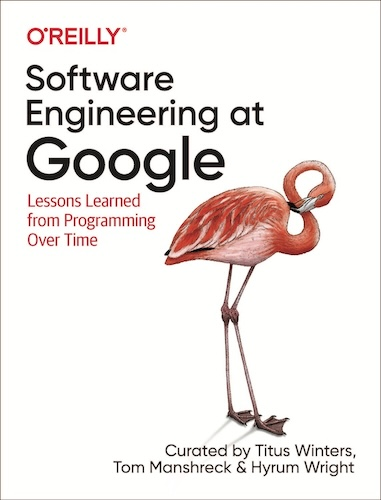

<figure class="figure">
  
</figure>

[Software Engineering at Google](https://abseil.io/resources/swe-book) is, unsurprisingly, a book about how Google engineers develop software.

For years, Google has captivated the curiosity of software engineers. After all, they built things like [Bigtable](https://research.google/pubs/pub27898/), [Spanner](https://research.google/pubs/pub39966/), and many others. 

However, this book delves behind the scenes, emphasizing three key areas:

- Processes
- Tools
- Culture

Let's cover each, as I think some parts are more insightful than others.

## Remember that You Aren't Google

Keep in mind one thing while reading this book: Most companies don't have the problems, the scale, or the resources that Google has. For most people, many of the solutions presented in this book won't apply.

I've only realized this after I joined a BigTech company. It's hard to picture the difference in scale until you see it firsthand. For instance, I find [stacked diffs](https://newsletter.pragmaticengineer.com/p/stacked-diffs) quite useful. However, I think they work in a very specific environment, and I've got ex-colleagues who just couldn't imagine that being useful. And that's fine.

Anyways, back to the book.

## Processes: Making it Work At Scale

Google is renowned for its massive mono repo. What you do can affect a lot of other engineers, thus they developed a strong culture around reviews. They have systems around who can review which technology or aspect that's quite interesting. In a past gig, they copied the system with terrible results. Beware of copying anything if you don't have the necessary resources.

Another unique area is testing. At this size, running tests becomes kind of a probabilistic exercise. Any test that can be flaky will become so if it runs millions of times. Google is also famous for having popularized the [SRE](../book-review-site-reliability-workbook/) role. However, operations aren't covered in this book that much.

## Tools: The Secret Weapon

Tooling is my favorite part of this book. Developer tools that seamlessly work are extremely satisfying. Also, this is the last thing a small company should try to copy. Internal tools are challenging to nail, and the incentives skew against them.

Moreover, it's an existential thing at a certain scale. A mono repo as gigantic as Google's needs top-notch tooling. Otherwise, you can't even browse files properly. The same goes for navigating code. You need a supercharged `grep` that works quickly and reliably across the whole repo.

I really like the chapter that touches on large-scale changes. A change across hundreds or thousands of files feels magical when it actually works.

Interestingly, CI/CD is pretty vanilla at Google. Granted, it seamlessly works with much bigger volumes of changes. Other than that, it doesn't do anything out of the ordinary. Check this [old article I wrote for comparison](../modernizing-your-build-pipelines/).

## Culture: Have the Right People

Culture is the weakest part of the whole book. It left me pretty cold. My theory is that BigTech has such a huge pool of candidates willing to join that it can rely on a pretty decent average for engineers. Some of the agile methodologies seem to make less sense in this context.

Reading through these chapters didn't feel too insightful. I'd rather check [Team Topologies](../book-review-team-topologies/), [Accelerate](../book-review-accelerate/), or plenty of other books.

## Verdict

A few years ago, reading about Google practices could feel like science fiction. Nowadays, cloud providers and a host of SaaS tools for observability, feature toggles, and whatnot have made this tooling accessible. It doesn't feel as foreign as it once did, although we're still talking about a completely different game in terms of scale.

Nevertheless, it's an enjoyable read. You get a reasonable idea of how BigTech works internally, in case you [want to get in](../tips-for-coding-interviews-at-faang/). The book gets ⭐⭐⭐⭐ stars from me.
